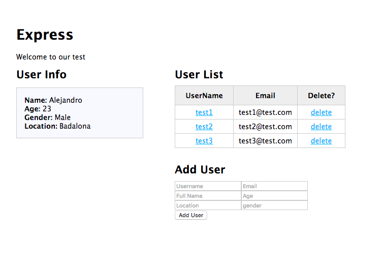

## Tutorial NodeJS - Mongo DB - Express 
 


## Description:

- *This project will be built under NODE , using its framework Express and backed by MongoDB as data base. In this tutorial we will see from the installation of everything needed for the project to its development , seeing three types of sentences (get, insert and delete) in MongoDB . The project idea is do a database control, who can add, delete and show info about users.*

## Installing 

### NodeJS
- 
https://nodejs.org/en/download/
https://docs.npmjs.com/getting-started/installing-node

### Express
- https://expressjs.com/en/starter/installing.html

### MongoDB
- 
http://www.mkyong.com/mongodb/how-to-install-mongodb-on-mac-os-x/

---

### Pure HTML or Jade? Your choice.

- In this project, we must download a previous project and modify it, we use Jade extension, this project can be good oportunity for learn this smart and minimal framework.  

You want change Jade files for made yourself HTML? Is your choice. 

## Building the project



### Downloading nodetest2 and re-make it

- Downloading...

```bash
    > express nodetest2
```

- Modify package.json like this: 
*C:\NODE\NODETEST2\PACKAGE.JSON*

```bash
    {
        "name": "nodetest2b",
        "version": "0.0.0",
        "private": true,
        "scripts": {
            "start": "node ./bin/www"
        },
        "dependencies": {
            "body-parser": "~1.12.4",
            "cookie-parser": "~1.3.5",
            "debug": "~2.2.0",
            "express": "~4.12.4",
            "jade": "~1.9.2",
            "morgan": "~1.5.3",
            "serve-favicon": "~2.2.1",
            "mongodb": "^1.4.4",
            "monk": "^1.0.1"
        }
    }
```

- And make a new folder for database storage

```bash
> mkdir data
```

- Modify layout.jade too

```jade
doctype html
html
      head
        title= title
        link(rel='stylesheet', href='/stylesheets/style.css')
    body
        block content
        script(src='http://ajax.googleapis.com/ajax/libs/jquery/2.0.3/jquery.min.js')
        script(src='/javascripts/global.js')
```

- You miss CSS? Don't worry, let's download and replace in nodetest2 :)
http://cwbuecheler.com/web/tutorials/2014/restful-web-app-node-express-mongodb/style.css

- Modify index.jade (C:\NODE\NODETEST2\VIEWS\INDEX.JADE)

```jade
 extends layout
 block content
 h1= title
 p Welcome to our test
 
 // Wrapper
 #wrapper
 
     // USER LIST
     h2 User List
     #userList
         table
             thead
                 th UserName
                 th Email
                 th Delete?
             tbody
     // /USER LIST
 
 // /WRAPPER
```

- And that's it! We can start, if you do all this properly, if you run the project with *npm start*, and navigate to localhost:3000, you should see something boring thing... Let's change it to cool project!

- In a new terminal or command prompt window, navigate to wherever you keep MongoDB (for example: C:\mongo\bin) and type

C:\MONGO\BIN\

```bash
> mongod --dbpath c:\node\nodetest2\data
```

- Obviously if you've decided to store your data elsewhere, you should use that path instead. You should see the MongoDB daemon fire up and report that it's waiting for connections. So let's connect: open up a new terminal/command window, navigate to your Mongo directory, and type:

_C:\MONGO\BIN\_
```bash
> mongo
```

### STEP 1 - LISTENING/GET info

- First, we want add a user manually like...

```mongodb
> db.userlist.insert({'username' : 'test1','email' : 'test1@test.com','fullname' : 'Test','age' : 30,'location' : 'New York','gender' : 'Male'})
```

**From mongo console!**

- and show the info in some fields-text...

```bash
    Name: test1
    Email: test1@test.com
    Full Name: Test
    Age: 30
    Location: New York
    Gender: Male
```

### STEP 2 - ADD (Insert) info

- We want add more example users, then, we must create the function, path, JSON call... easy, no?
- Asure that you can show the info about the new users, the info shouls refresh automatically!
- In the Chrome console log, you can see the errors and check what fails, you can use break points...(?)

### DELETE info

- As the Add function..., should be something like:

```javascript
        $.ajax({
            type: 'DELETE',
            url: '/users/deleteuser/' + $(this).attr('rel')
        })
        .done(function( response ) {...}
```

The changes should automatically refresh the user list in main mpge.

---

##Extra

## Post the project on Heroku
https://devcenter.heroku.com/articles/getting-started-with-nodejs#set-up


