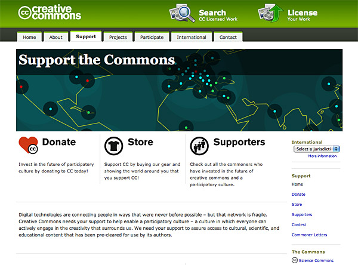

## Pre-Curs SkyLab Coders ~60 exs. 
### Study sessions (Strings, Loops, Conditionals)
### Ex. 1 - Strings 

**Exercise**: *Identify yourself, who are you?*

a) Define a **string var** with your name 
b) Now, show your name in **console terminal**

```
> console.log(name);
'name'
```

c) Fine, now, define a var with your age and **show your age and name** also using the console

```
> console.log(name + age);
'name , age'
```

d) Pass this vars as parameters in a **function** that shows them on the console

```
> showMyData("alex", 25);
alex 25
```

e) Now, show your info with a pretty **presentation message**

```
> showMyData("alex", 25);
My name is alex and I'm 25 years old
```

f) **Add** a new parameter to the function for your current city, Can you **RETURN** the updated presentation message?

```
> var myData = showMyData("alex", 25, "barcelona");
> console.log(myData);
My name is alex, I'm 25 years old and I live in barcelona
```
_Hint: test your function w/ different values_

g) Modify your function to receive data in an **array**. Should return the same

```
> var myData = showMyData(["alex", 25, "barcelona"]);
> console.log(myData);
My name is alex, i'm 25 years old and i live in barcelona
```

h) Modify your function to return the string **"ERROR!"** if second parameter is not a number

```
> var myData =  showMyData(["alex", bbbbb, "barcelona"]);
> console.log(myData);
ERROR!
```

_Hint: `typeof( ANY_NUMBER )` returns the string "number"_ 

i) Modify your function to receive values in a string **separated by '|'**. Should return the same (also the error logic)

```
> var myData = showMyData("alex|25|barcelona");
> console.log(myData);
My name is alex, I'm 25 years old and I live in barcelona

> var myData = showMyData("alex|aaaaa|barcelona");
> console.log(myData);
ERROR!
```

j) Add a new function to your program **that insert a new value** in the array, asure the changes are completed in console.

```
> function addValue(value)
> console.log(array)
'value1, value2, value3...' <- updated
```

k) Now, after insert some new values, modify the function for return the array values **separated by '&'**.

```
> console.log(array);
value1 & value2 & value3...
```

---

### Ex. 2 - Loops

**Exercise**: *Counter*

a) We want to do a counter, from 0 to 5.

```
> for (var i = num; i >= 0; i++) **SHOW NUMBERS** };
0
1
2
3
4
5
```

b) You can add a message when the count is over?

```
0
.
.
.
5
COUNT Finish!
```

c) Now we want to increase the count to 10.
d) You can do the same, but with an array?

```
> var array = [0,1,2,3,4,5]
> for(...){**SHOW NUMBERS**}
0 
1 
2 
3 
4 
5
```

e) So, how about create a friend list? Change the array values for your friends names and show in console.

```
> var array = [name1, name2, name3, ..., nameN]
> for(...){**SHOW NAMES**}
name1
name2
name3
.
.
.
nameN
```

f) Now we want add a number, show for console the array position of your friends behind their names.

```
> var array = [name1, name2, name3, ..., nameN]
> for(...){**SHOW NAMES**}
name1 - nº 1
name2 - nº 2
name3 - nº 3
.
.
.
nameN - nº N
```

g) You can add a last friend into a array? Show the updated array for console.

```
> var array = [name1, name2, name3, ..., nameN]
> for(...){
> array.addFriend()...
> **SHOW NAMES**
> }
name1 - nº 1
name2 - nº 2
name3 - nº 3
.
.
.
nameN - nº N
nameN +1 - nº N+1
```

h) create a loop for show in console the results from 0 to 50 in 5 to 5.

```
> for(...){**SHOW NUMBERS**}
0 
5
10
15
20
.
.
.
50
Finish!
```

i) Now, modify your program for shows the results to 0 to 100, in 10 to 10.

```
> for(...){**SHOW NUMBERS**}
0
10
20
30
40
.
.
.
100
Finish!
```

---

### Ex. 3 - Conditionals

**Exercise**: *If...*

a) Let's start with simple exersice, declare your name, if your name is bigger than 8 letters, show a message

b) Add your lastname and compare separated

c) Now, compare between they and show who is bigger.

d) CAlCULATOR. Multiply two numbers, so, compare the result with IF conditionals, if the result is > 10, show a message, if is < 10, show other message

```
function(n1, n2){
...
    if(res > 10){...)
        }else if(res < 10){..);
    }
}
```


e) Then, what happen if we multiply 5*"word"? The result is NaN (Not a Number), then we can control this error with other conditional, right? Let's do this.

http://www.w3schools.com/jsref/jsref_isnan.asp  <- Method isNaN

*Hint: if(isNaN(res)==true)*

f) CLOCK. Let's do other simply program that you pass one param. to a function, and the IF conditionals should print a message saying: Good morning/afternoon/night

```
function(hour){
    if(...){
    console.log("say something")
    } else if{console.log("say other thing")}...
}
```
g) After that, now, compare with the local hour

http://www.w3schools.com/jsref/jsref_obj_date.asp

```
var d = new Date(); //declare a new native javascript object (Date)
var n = d.getHours(); //and catch what this object can offer to us
...
if(...){
    console.log("the specify hour is after now")
}else{console.log("the specify hour is before now")}
```

h) **IF** the specify hour is equal to local hour? Control this exception! 

```
...
else if(...){...)}
...
```

i) BEATLES. Now we want to make a program that we specify the members of the Beatles, if are all the Beatles in the array, show "We're all!", if you specify 3 Beatles for example, say other thing.

```
var beatles = ["a","b","c","d"];
if(){
    ...
}
> We're all!

```

j) Now, declare an empty array and do a function that **PUSH** the names of all Beatles, the conditional IF **should** return "We're all!".

http://www.w3schools.com/jsref/jsref_push.asp <- Push Method

```
function(name,name2...){
    ...
    if(...){
    ...
    }else{console.log("something failed")}
}
```

k) Make other program that **push** all Beatles, when the four Beatles are in array, show a message, if the length of a array are < 4, show a message that say to user: Continue writing the names! 
*REMEMBER: Control the number of Beatles are in array after execute the function for sure you're pushing the names properly.*

**Hint: Make a empty array and push the results!**
```
**First time**
function addBeatle (otherName1){...
    if(total == 4)...";
        else(console.log("Somebody else...?"));
}
console.log("Now we are..." + total +  " Beatles")
> Somebody else...? Now we are 1 Beatles

**Second time**
function addBeatle (otherName2){...}
if(total == 4)...";
else(console.log("Somebody else...?"));
console.log("Now we are..." + total +  " Beatles")
> Somebody else...? Now we are 2 Beatles
.
.
.
```

l) ALEATORIO. Create a function that randomize a number and specify if the number are above or under the half of the maximum.

https://developer.mozilla.org/en-US/docs/Web/JavaScript/Reference/Global_Objects/Math/random  <- Random method of Math Object

**Hint: var val = Math.floor(Math.random()*max)+min;** 
```
> function aleat(max,min) {
>    var val = Math.floor(Math.random()*max)+min;
> ...
> }
*ej. Si el numero random es 20 y el numero max es 30*
out:
El numero 20 está por encima de la mitad(30 / 2)
```

## Challenges!

a)<a name="fibo"></a> **FINAL!**We turn back to numbers...
So, we want do a programm that execute the Fibonacci serie
https://www.mathsisfun.com/numbers/fibonacci-sequence.html

```
NºINICI = 0;
0 (NºINICI+0)
1 
1 
2 
3 
5
8
.
.
.
```

b) You can add the position of all sums?

```
0, pos 0
1, pos 1
1, pos 2
2, pos 3
3, pos 4
5, pos 5
8, pos 6

```

c) You can now specify the number of loops that the function must do?
```
function Fibo(10){
    ...
}
0
1
1
2
3
.
.
.
55 - pos 10º

```

d) **Simple Scripting program**. Create a program that transform a 4 number values code to diferents positions, making a new code.
Something like: 
3712 
:point_down:
7123
:point_down:
1237
:point_down:
2371
The first, go to the last position, second, third and four goes up.

*Hint:* Is necessary use FOR, IF and Array technolgies seen in precourse.

e) **Super-Challenge!!**
Create a program that use the Roman form for encrypt messages, how is that? Simple. If you have SKYLAB, the encrypted form is  SLKAYB...
If you divided the word in two groups of 3 letters, you get:
SKY
|-|-|
LAB 
Then, join the S with L, K with A and Y with B, and you get SLKAYB.

So, make a program that, receive the message SKYLAB and returns the SLKAYB.

f) Now, you can do the DECRYPTER? Pass the ENCRYPTED message (SLKAYB) and returns SKYLAB.
 **Hint:**: for decrypt, only catch the pair words like: **S**L**K**A**Y**B
 , then, you get SKY, the next step is catch the odd words, S**L**K**A**Y**B**
 group the two groups and you get the original word.

g) Group the **Encrypt** and **decrypt** functions in one unique function, pass the word SKYLAB and returns SKYLAB (with all the transformation...)

h) **You got it?** Then try now with SKYLABCODERS. Reform the program for can accept more large words.


---


## JS Objects

http://www.w3schools.com/js/js_objects.asp

*Simple JS Object for example.*

```
var student = { 
    name : "David Aughan", 
    class : "VI", 
    id : 12 
};

```

a) Do a simple function for show the names of the properties. 
output: name/class/id

b) Now, do a simple function for show the **content** of those properties.

c) So, we can change a property value? Change the class to "XI".

d) Now, delete the id property.

e) List the number of properties we have now on objects.

f) Add a new property called **city** and give some value

http://www.w3schools.com/js/js_properties.asp

g) Change the property **name** to **fullName**

h) For last, add a presentation message like: "Hello, my name is " + student.name....., and show all values of the object.


---

## Pair Programming
https://en.wikipedia.org/wiki/Pair_programming

https://codepad.remoteinterview.io/ **<- co-working online tool**

https://js.do/ **<- compile and execute your code online**

**BINGO!**
a) Let's start! Let's make a simply Bingo, okay?
Let's start , we have a card with numbers distributed in five columns by three rows, each turn a ball is taught with a number, if the number displayed matches any of the card , it will display a message.

b) Now we want change the number matched to "X" or 0, and display a message when all row is matched. LINE!

c) So, after this, we want do the same with all card, said BINGO when all numbers are GONE.

**Rock, Paper, Scissors in JavaScript**
d)We want do this famous game in JS... The user must choose one posibility and the computer other, display who wins in a message.

e) Let's make a scoreboard, who wins 3 matchs, wins the game.

f) Catch the errors, if you and the computer choose the same option, the computer should choose again.

g) You can do a version for playing without the computer? 1 VS 1 with your partner.


## HTML & CSS MARKUP

http://www.w3schools.com/tags/ <- List of all tags of HTML lenguage


*Basic estructure for HTML main page*

####Exercise: 
Do the semantic markup for the following image(**no styles**, only semantic HTML).


---


---


---




####Exercise: JS <script type="text/javascript"></script>!!

We learn about Javascript and HTML-CSS basic, how they are relacionated? You must need have the HTML Syntax, CSS selectors and JS features clear.

http://www.w3schools.com/js/js_whereto.asp 
http://www.w3schools.com/js/tryit.asp?filename=tryjs_whereto_head
http://www.w3schools.com/js/tryit.asp?filename=tryjs_whereto_body
http://www.w3schools.com/js/tryit.asp?filename=tryjs_whereto_external

FIRST!) Make a JS script in HTML page, this script cath two numbers and get the sum, rest, mult and div for console.

Now, you can insert the results in a table?

http://www.w3schools.com/cssref/css_selectors.asp

a) Make a Simple HTML with a simply form with 2 fields, name and lastname, with a JS insered in HTML code, catch the forms values with a button that execute the JS code and display it in console.

```
<textarea id="code">EXAMPLE</textarea>
<button id="button">EXAMPLE</button>
<pre id="output"></pre>

<script>
  // Your code here.
</script>
```

b) Got it? Add 3 fields more to form, like age, city and job. Catch the values and show it in pretty message.

c) Now, add two buttons more for change the colour of the text fields of form.

d) Now, you can separate the JS code in other file? Remember organize the structure of the project well.

e) Add a disabled and empty text field, when the form values are catched, should appear the message "We have the values!" in the empty text field.

f) Add a radio button with some options, like... If user like car, bike or motorcycle, so, catch the value and show it joined the rest of message

g) At least, add a textarea that user must write simply text on it and in JS, count the number of letters have the text.
http://www.w3schools.com/tags/tag_textarea.asp

h) As a final challenge, you remember the [Fibonacci](#fibo) ?
Instert the values in a table from 0 to 15 loop.

---


