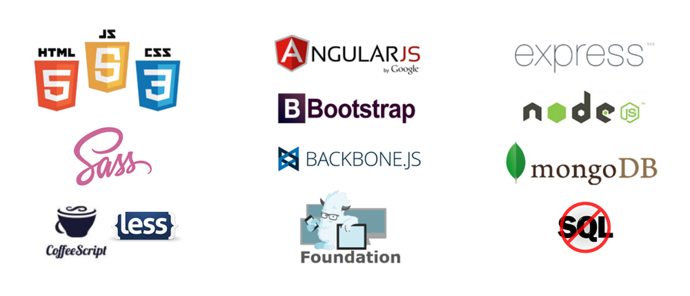

## 
### Javascript exercises 


#### Information and resources before start...
**What is Javascript?**
- https://developer.mozilla.org/en-US/docs/Web/JavaScript/Guide/Introduction

**What is the difference between FrontEnd and BackEnd?**

- http://blog.udacity.com/2014/12/front-end-vs-back-end-vs-full-stack-web-developers.html

**What I can use for work?**
- We use the <a target="_blank" href="https://developers.google.com/web/tools/chrome-devtools/">Google Developers Tools</a>, a simple and minimal IDE avaiable in Google Chrome for test your code and see the result, we can modify any element of HTML in the current page too for see the changes without affect the original code. 

1. *How to access?*


2. *Console.*


- For developer our code, we use <a target="_blank" href="http://www.sublimetext.com/">Sublime Text </a>, for make simply test we can use the GDT directly, but our code must be built always with Sublime Text.
-> *Remember save your code file with **.js** extension!*

- It's good practice save all your exercise solutions, with a less comment about what your code do. The comments in Javascript are written with "//" before the comment, this make a non executable line, is only for information about your code, for you and for other who can see it.

```
//Example: 
//This is my exercise, this code pass two numbers as a parameter in function and returns the sum.

function sum(a,b){
    return a+b;
}
```

- In case of doubts or problems, contact to:
*alejandro.delgado@skylabcoders.com*

---


#### Variables, Strings, Arrays, Loops and Conditionals.
#### Index:

- <a target="_blank" href="http://www.w3schools.com/js/js_variables.asp">Vars</a> -> [Go to exersises](#vars-10-exs) 
-  <a target="_blank" href="http://www.w3schools.com/js/js_strings.asp">Strings</a> ->[Go to exersises](#strings-12-exs) 
- <a target="_blank" href="http://www.w3schools.com/js/js_arrays.asp">Arrays</a> ->[Go to exersises](#arrays-10-exs) 
- <a target="_blank" href="http://www.w3schools.com/js/js_loop_for.asp">Loops</a> ->[Go to exersises](#loops-10-exs) 
- <a target="_blank" href="http://www.w3schools.com/js/js_if_else.asp">Conditionals</a> ->[Go to exersises](#conditionals-10-exs) 

#### Start the exersises! 

#####Vars (10 Exs)

Resources to see:

1. https://developer.mozilla.org/en-US/docs/Web/JavaScript/Reference/Global_Objects/NaN

2. http://www.w3schools.com/js/js_datatypes.asp

a) Say hello to our Chrome console!
*Hint: With console.log sentence we can print any sentence in console.*
// *output: Hello!*

b) Whats you'r name?
// *output: My name is Stark, Tony Stark*

c) Tell us your age, how old are you?
// *output: My name is Stark, Tony Stark, and I'm 40 years old*

d) You can call the same message but with your job in one var?  
*Hint: We can save data in a var and show the content calling in console.log , so, instead, you can call a var and message in same console.log with the symbol + in the middle of orders.*
//*output: My name is Tony Stark, I'm 40 years old and my job is: millionaire, filántropist and genious.*

e) You can save your name and your age in vars too and call in other message?
//*output: My name is: Tony Stark, I'm: 40 years old, and my job is: millionaire, filántropist and genious.*

f) We can operate with the simply operators like +, -, *, /, you can sum 2+2 directly in console.log?

g) You can save two numbers in vars and sum the content of it?

h) Now try to make a Multiplication

i) We can concadenate operations too, you can make a sum -> rest -> mult -> div and the result must be 15?

j) And now, try to make **"A"*2**, what you see?

- Now, this is not our problem, let's continue the jorney!

---


#####Strings (12 Exs)
Resources to see:

1. http://www.w3schools.com/js/js_strings.asp
2. http://www.w3schools.com/js/js_string_methods.asp

a) Let's start, make a var with your name and make sure that is a string using typeOf() operator.
=> https://developer.mozilla.org/es/docs/Web/JavaScript/Referencia/Operadores/typeof
//*output: "Tony" -> true*

b) And now, add your age, make the same way and should return other thing.
//*output: 40 -> false*

c) Write your name and your lastname in vars and add the string "is cool" in the console.log();
//*output: Tony Stark is Cool*
    c2)Write a console.log that shows your email in format name.lastname@example.com, name and lastname are string vars, concadenate the string **"@example.com"**
    //*output: tony.stark@example.com*

d) Write your name in a lower case and print it with the capital letter in a console.log.
*Hint: capitalize("avengers")*
//*output: Avengers*

e) Now, you can capitalize two strings and show for console?
//*output: Team Avengers, Real Power!*

f) You can convert the Upper letters to Lower case and Lower to Upper?
=> http://www.w3schools.com/jsref/jsref_toLowerCase.asp
//*output: *tEAM aVENGERS, rEAL pOWER!*

g) Now, we want a team change, you can **replace** the string "Avengers" for "Guardians of Galaxy"?
//*output: Team Guardians of Galaxy, Real Power!*

h) Show the first word
//*output: Team*

i) Show the last word
//*output: Power!*
    i2) Now, convert all catched word to UPPERCASE! 
    //*output: POWER!*

j) Show for console the first letter
=> http://www.w3schools.com/jsref/jsref_charAt.asp
//*output: T*

k) You can show the first letter of second word?
//*output: G*

l) Show your initials from your full name using charAt(); adding a dot between the letters 
//*Output: Tony Stark -> T.S*


---

#####Arrays (10 Exs)
Resources to see:

1. http://www.w3schools.com/js/js_arrays.asp
2. http://www.w3schools.com/js/js_array_methods.asp

a) Let's make a simple Array with some mates of our team... and show they!
//*output: IronMan, Hulk, Thor, Captain America*

b) We can show our favourite superhero?
//*output: IronMan*

c) Now, show the same and other more, he's never alone!
//*output: Ironman, Thor*
    c2) Add a message after their names, like...
    //*output: Iron, Thor...Really Cool!*

d) Now show the first letter of our hero's name!
//*output: I, H, T, C*

e) Add more superheros and show they!
=> http://www.w3schools.com/jsref/jsref_push.asp
*Hint: you can add a last element in array without use push();...*
//*output: Our last joined team mates are: Scarlet Witch, Hawkeye*

f) Show the names of all mates adding a separator:
=> http://www.w3schools.com/jsref/jsref_join.asp
//*output: IronMan and Hulk and Thor and Captain America and Scarlet Witch and Hawkeye*
    f2) Show a message after print the array...
    //*output: IronMan and Hulk and Thor and Captain America and Scarlet Witch and Hawkeye are really cool!*

g) How many heros are in our team?
=> http://www.w3schools.com/jsref/jsref_length_array.asp
//*output: 6 REAL HEROES!*

h) Now, replace one superhero for other and asure the changes

i) Create other array with the score of our superhero's and get the sum
//*output: The score of avengers is: 40*

j) now get the score average of our team!
//*output: and the score average is: 9*

---


#####Loops (10 Exs)
Resources to see:

1. http://www.w3schools.com/js/js_loop_for.asp

a) Let's make a simply counter, from 0 to 10
//*output: 0,1,2,3...10*

b) Now, change your code for the counter goes 2 to 2
//*output:0,2,4,6,8,10*

c) Create other array with the numbers, and show all they

*Hint_*
```
for (var i = 0; i > Things.length; i++) {
...
};
```

d) The hero's are back! Let's show the elements of array using a Loop
//*output: IronMan, Hulk, Thor, Captain America*
    d2) Show their position too!
    //*output: IronMan - 0, Hulk - 1...*

f) Now, reverse the output, starting for the last element of array 
//*output: Captain America - 3, Thor - 2...*

g) Now, show only the initial element and the second.
//*output: IronMan - 0, Thor - 2*

h) And now, show the first and last 
//*output: Hulk - 1, Captain America 3*

i) Now, in two different loops, show the same teams as past exercises and go to battle between they
//*output: IronMan, Thor VS. Hulk, Captain America* 

---


#####Conditionals (10 Exs)

Resources to see:

1. http://www.w3schools.com/js/js_if_else.asp
2. https://developer.mozilla.org/es/docs/Web/JavaScript/Guide/Expressions_and_Operators#Operadores_de_comparación <- Comparation operators.

a) Save your name in a var and catch if your name is really your name, show a message, if not, other
//*output: Hello, Mr. Stark*
//*output: You're not my master...*

b) Now, save your age and catch if is under 18 show a message, if not show other
//*output: Hello Young Stark*
//*output: First finish your MIT degree...*

c) Catch if is morning or not, and show one message or other
*Hint_ Use other helper var for save your current hour.*
//*output: Good Morning Mr.Stark*

d) Add other conditional for if is at night.
//*output: Good Night Mr.Stark*

e) Now, show all team mates again and when it's over, show a message
//*output: IronMan...Captain America, we're all!*
    e2) Show a message at the start of counter
    //*output: The Avengers are: IronMan...Captain America*

f) Now, before show Captain America name, show a message.
//*output: IronMan...and our Leader is: Captain America*

g) With the team we have now, we're not all, show a message for if the member numbers are <= 4.
//*output: Mr. Stark, the Avengers are not ready*
    g2) Great! Now add some members more and asure other message
    //*output: Great! We start look like a real team*

h) Yay! Let's do something more complicated, now we want locate if Hulk is in our team.
//*output: Hulk is in our team, the victory is garanteed*
    h2) Perfect, now catch the exception if not exist the superhero.
    //*output: We have a problem...*

i) Now, we want catch what name of our hero's is the large.
//*output: So large name no? Mr. Captain?*

j) And the little?
//*output: Hulk has the tiny name...*


